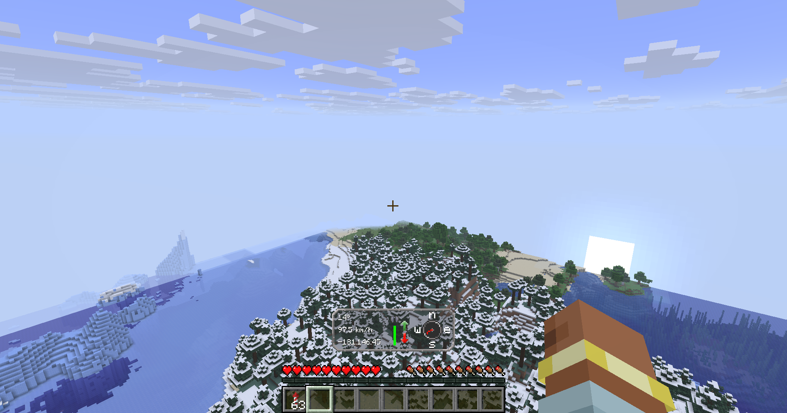
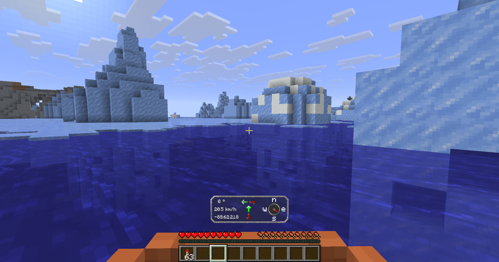
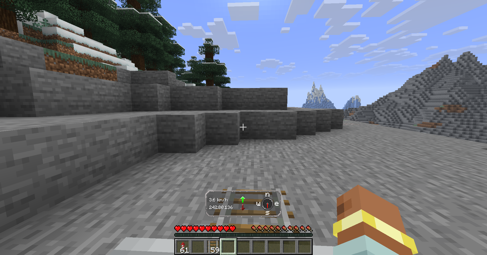

# Simple Transport HUD

Simple Transport HUD adds simple HUD:s to many transports in Minecraft.

The mod comes with an extensive config. You can access it with ModMenu and YACL

Transports included:
- Elytra
- Minecarts
- Boats
- More coming

Examples:
- Elytra 
- Boat 
- Minecart 

# Looking for a server?
Get BisectHosting and save 25% off for new customers using code Lukas at checkout.
Thanks for your support — it helps me develop this and other mods I make!
#ad

# Open source
Nearly all my mods are OpenSource and under the MIT license.
If you want to help the development, check out the [GitHub](https://github.com/lukasabbe/SimpleTransportHud)!

# Inspiration and credit
- Lukasabbe mode the coded
- Lemonixi made the graphics.
- Smurre requested it

Thank you all for downloading the mod!